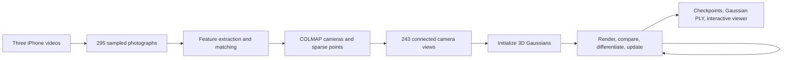

# Learning gsplat through the toyroom reconstruction

The pipeline solves two related optimization problems. COLMAP estimates the
cameras and a sparse geometric model. Gaussian-splat training then optimizes
an explicit collection of colored, translucent 3D Gaussians so that rendering
them through those cameras reproduces the photographs.

The completed baseline uses 3,201,778 Gaussians after 30,000 steps. Training
and checkpoint evaluation took approximately 18 minutes on the RTX 5080,
excluding frame preparation, COLMAP, and software installation. On the same
31 held-out views, the saved checkpoints compare as follows:

| Checkpoint | PSNR (higher is better) | SSIM (higher) | LPIPS (lower) |
| --- | ---: | ---: | ---: |
| 7,000 steps | 24.63 dB | 0.852 | 0.364 |
| 30,000 steps | 25.70 dB | 0.861 | 0.278 |

The bookshelf, lamp, toys, and TV are recognizable and often detailed.
Several close curtain, blank-wall, and occluded-furniture views remain smeared
or incomplete. These metrics describe image agreement within the captured
view distribution; they do not establish metric accuracy or complete geometry.



1. **Inspect the recordings.**

   The original clips last 36.10, 31.10, and 31.27 seconds. Each stores
   3840 × 2160 pixels with a rotation tag indicating portrait presentation.
   All three use H.264 and SDR/BT.709 color encoding. The videos contain actual
   camera movement around a mostly static room, which supplies the different
   viewpoints needed for geometric reconstruction.

   Camera translation creates parallax: nearby objects shift relative to
   farther objects. A single stationary camera, or pure rotation about its
   optical center, cannot provide ordinary triangulation with a useful depth
   baseline. Multiple clips only help if they have enough shared visible
   structure to connect their coordinate systems.

   Exposure and white-balance consistency help because training compares
   image colors. Motion blur damages fine feature localization. Glass,
   reflections, moving objects, and textureless walls can violate assumptions
   or provide weak geometric evidence. Locking camera settings helps, but
   does not eliminate these issues.

2. **Convert video into photographs.**

   FFmpeg applies the portrait rotation, samples at 3 fps, and resizes to
   1080 × 1920. The clips contribute 108, 93, and 94 JPEGs. Their transfer to
   Alienbot was verified with SHA-256 checksums.

   ```bash
   ffmpeg -i toyroom1.MOV -vf 'fps=3,scale=-2:1920' -q:v 2 \
     data/images/toyroom1/toyroom1_%05d.jpg
   ```

   Three fps is a practical starting choice, not a format requirement.
   Adjacent 30 fps frames are often nearly duplicates. Processing every frame
   increases storage, matching work, and image-loading cost without a
   proportional increase in useful viewpoints. Sampling too sparsely can
   instead break overlap. Sharpness and coverage matter more than raw count.

   The originals remain unchanged. Downscaling a 4K frame by two in each
   dimension gives one quarter as many pixels. This reduces several image
   processing costs, though total training memory and time also depend on
   the Gaussian count and how much their projected footprints overlap.

3. **Extract and match features.**

   COLMAP uses SIFT to identify distinctive local patterns and describe them
   numerically. Useful examples in this room include toy details, shelf
   corners, and rug patterns. Large blank walls offer fewer constraints.

   Exhaustive matching considers all image pairs: 295 × 294 / 2 = 43,365.
   This connects overlapping views across all three clips. Most candidate
   pairs have little useful overlap. Descriptor similarity proposes matches;
   geometric verification rejects matches inconsistent with plausible
   camera geometry. Repeated patterns can otherwise produce convincing
   but incorrect visual matches.

   Sequential matching would consider fewer pairs and can be useful for
   larger video datasets. Separate sweeps still need cross-clip connections
   and loop closure. Exhaustive matching is manageable for this first dataset.

4. **Estimate cameras and triangulate points.**

   Camera extrinsics describe position and orientation. Intrinsics describe
   focal length, principal point, and distortion. We use one SIMPLE_RADIAL
   camera calibration per clip, shared by that clip's frames.

   SIMPLE_RADIAL has four intrinsic parameters: one focal length, two
   principal-point coordinates, and one radial-distortion coefficient.
   The recovered focal lengths are about 1467, 1468, and 1475 pixels at the
   resized resolution. Pixels here are a coordinate unit, not millimeters.

   Observations of the same feature in multiple views define viewing rays.
   Triangulation estimates the corresponding 3D point. COLMAP incrementally
   registers additional images and uses bundle adjustment to refine camera
   poses, lens parameters, and points together.

   Reprojection error measures the pixel distance between an observed feature
   and the projection of its estimated 3D point. The selected reconstruction
   has 243 registered images, 53,318 points, and a mean error of 0.789 pixels.
   Its average point track spans 5.18 observations. The registered images
   comprise 84 from clip 1, 78 from clip 2, and 81 from clip 3.

   COLMAP also found an isolated three-image model. The project selects the
   largest connected model, number 1, through `data/aligned`. Blindly using
   `sparse/0` would train on the wrong component in this case.

   Low reprojection error is encouraging, but does not prove accurate depth,
   physical scale, or complete geometry. Without a known distance or another
   scale reference, monocular reconstruction has arbitrary scale.

5. **Prepare the training dataset.**

   The gsplat loader reads the cameras, image associations, and sparse points.
   It undistorts the photographs with the recovered camera model. The sampled
   outputs checked in this run are 1079 × 1919 after the loader's small crop.
   Intrinsics must remain consistent with any image resizing or cropping.

   The loader also normalizes the scene's coordinates. This improves numerical
   conditioning; it does not establish metric scale. A sparse cloud is only
   a set of triangulated features, so holes in it are expected. It is not a
   dense surface mesh.

   Every eighth registered frame is reserved for evaluation, leaving 212
   training images and 31 held-out images. These are nearby views from the
   same sweeps, so their evaluation is easier than testing an unseen room
   corner. The trainer's worker processes decode and undistort images while
   preparing batches. Image loading and GPU rendering are separate costs.

6. **Initialize the Gaussians.**

   Each sparse point seeds a soft 3D ellipsoid. Its parameters are a position,
   three scales, a rotation quaternion, opacity, and color coefficients.
   Initial colors come from COLMAP observations; initial sizes reflect local
   point spacing. This places the initial model near observed structure.

   An ellipsoid's scale and rotation define its covariance matrix. Its spatial
   weight is proportional to exp(-0.5 × (x-μ)ᵀ Σ⁻¹ (x-μ)), where μ is the
   center and Σ describes its extent and orientation. Influence decreases
   smoothly away from the center. Flattened Gaussians can approximate small
   surface patches, while many smaller Gaussians represent fine detail.

   The usual parameterization optimizes logarithmic scales and opacity logits,
   converting them to positive scales and bounded opacities during rendering.
   These transformations keep the physical parameter ranges sensible while
   allowing unconstrained numerical optimization.

7. **Render an image by splatting.**

   From a requested camera pose, the renderer projects each visible 3D
   Gaussian into a soft 2D ellipse. It identifies affected image tiles,
   approximately sorts contributions by depth, and alpha-composites them.

   A splat's effective alpha at a pixel depends on its opacity and its
   Gaussian footprint there. If the foreground effective alpha is 0.7,
   about 0.3 of the contribution from behind remains available. For ordered
   splats, a pixel's color has the form Σᵢ Tᵢ αᵢ cᵢ plus the remaining
   background contribution, where Tᵢ = ∏ⱼ<ᵢ (1-αⱼ).

   The key capability is differentiability: the renderer computes how image
   values change when positions, scales, rotations, opacities, or colors
   change. PyTorch uses these derivatives to optimize the explicit Gaussian
   parameter arrays. Semantic labels such as "shelf" or "giraffe" are not
   required by this default pipeline.

8. **Train with render–compare–adjust iterations.**

   Each step selects one training photograph, renders the current model from
   its known camera, computes an image loss, backpropagates gradients, and
   updates parameters with Adam. The configured loss weighting is 80% L1
   pixel error and 20% an SSIM-based structural term.

   Camera optimization and appearance-correction modules are disabled in this
   baseline. The cameras remain fixed at their COLMAP estimates. Separate
   parameter groups have different learning rates because moving a point,
   changing its opacity, and changing its color have different sensitivities.

   `train.sh` requests 30,000 optimizer steps with batch size one. A step is
   not an epoch over every image. With 212 training views, 30,000 steps means
   about 142 image selections per training view on average, although the
   Gaussian population and optimization schedule change during the run.

9. **Adapt the representation and model directional color.**

   Densification changes the number of Gaussians. The default strategy uses
   image-space gradients and sizes to decide when to clone or split them,
   and prunes Gaussians meeting removal criteria such as very low opacity.
   Opacity resets temporarily lower opacities during optimization. Parameter
   optimization and population changes work together.

   Higher Gaussian counts can represent more detail, but can also fit blur,
   inconsistent reflections, or camera errors. Counts alone are not a quality
   score. More training cannot recover surfaces the images never constrained.

   Colors use spherical harmonics, a compact basis for smooth functions of
   viewing direction. Degree zero is direction independent; the trainer
   gradually enables terms up to degree three. Degree three has 16 basis
   coefficients per color channel. This supports some view-dependent
   appearance, but does not provide a complete lighting or material model.

10. **Evaluate, inspect, and export.**

    At checkpoints the trainer renders held-out cameras and computes PSNR,
    SSIM, and LPIPS. PSNR reflects pixel error, SSIM local structural
    similarity, and LPIPS a learned perceptual difference. Higher PSNR/SSIM
    and lower LPIPS generally mean better agreement under the same evaluation
    setup. Different datasets and preprocessing make direct comparisons hard.

    Visual inspection remains essential: look for doubled edges, floating
    fragments, blurry surfaces, holes, and shapes that collapse away from the
    capture path. Glass and unobserved surfaces deserve particular scrutiny.
    The held-out photographs and interactive novel viewpoints answer different
    questions about quality.

    The command saves checkpoints and Gaussian PLY exports at 7,000 and
    30,000 steps under `results/default`. Checkpoints preserve the trainer's
    model representation. Gaussian PLY stores splat attributes for compatible
    viewers. A file ending in `.ply` can also be an ordinary point cloud;
    COLMAP's sparse PLY and gsplat's Gaussian PLY contain different information.

    A splat scene supports novel-view rendering. A watertight mesh, collision
    geometry, reliable physical measurements, or relightable assets require
    additional methods and validation.

**Inspect the representation yourself.** Inside the project on Alienbot, this
reads the final checkpoint on the CPU and prints the parameter-array shapes:

```bash
.venv/bin/python - <<'PY'
import torch
checkpoint = torch.load(
    'results/default/ckpts/ckpt_29999_rank0.pt',
    map_location='cpu', weights_only=True,
)
for name, values in checkpoint['splats'].items():
    print(name, tuple(values.shape))
PY
```

For N Gaussians, `means` is N × 3, `scales` is N × 3, `quats` is N × 4,
and `opacities` contains N values. `sh0` is N × 1 × 3 and `shN` is N × 15 × 3.
The stored scales are logarithms and the stored opacities are logits; apply
`torch.exp` and `torch.sigmoid`, respectively, to interpret them physically.
The color coefficients need spherical-harmonic evaluation for a chosen view
direction; they are not simply a list of RGB pixel values.

The training loop conceptually performs the following operations. Densification
and pruning additionally replace or resize these parameter arrays and their
associated optimizer state at scheduled steps.

```python
predicted_image = render(splats, photograph.camera)
loss = 0.8 * L1(predicted_image, photograph.image) + 0.2 * (1 - SSIM(...))
loss.backward()
optimizers.step()
optimizers.zero_grad()
```

This is conceptual pseudocode, not a replacement for the upstream trainer.
The saved `.pt` file contains the model and step; it does not preserve every
optimizer and densification-state variable needed for an exact training resume.

**What the environment setup does.** WSL2 runs the Linux tools while using
the Windows NVIDIA driver. The project uses PyTorch 2.9.1 with CUDA 12.8 and
compiles gsplat 1.5.3 for the RTX 5080's `sm_120` architecture. CUDA compilation
turns source kernels into executable GPU operations; it uses the CPU and is
separate from training on the room. The cached build can be reused. A compatible
prebuilt wheel can avoid source compilation when one matches the environment.
Updating PyTorch, CUDA, or gsplat may require rebuilding binary extensions.

**Files to inspect on Alienbot.** The root is
`/home/wengm/toyroom-reconstruction`. `reconstruct.py` runs COLMAP, `train.sh`
runs the official trainer, `cuda-env.sh` sets the build/runtime environment,
and `input-manifest.json` records original video metadata. Large frames,
models, logs, environments, and the upstream checkout are excluded from Git.

**Primary references.** The [COLMAP tutorial](https://colmap.github.io/tutorial.html)
explains its processing stages; [camera-model documentation](https://colmap.github.io/cameras.html)
covers calibration choices. The [original 3DGS project](https://repo-sam.inria.fr/fungraph/3d-gaussian-splatting/)
provides the paper and reference implementation. gsplat documents
[rasterization](https://docs.gsplat.studio/main/apis/rasterization.html),
[densification](https://docs.gsplat.studio/main/apis/strategy.html), and its
[COLMAP training example](https://docs.gsplat.studio/main/examples/colmap.html).
